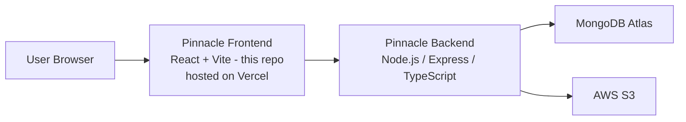

# Pinnacle — Frontend

Client application for Pinnacle, a full-stack business management platform — covering operations, customer interaction, and real-time admin analytics.

---

## 1. What Was Built

- A React (Vite) single-page application consuming the Pinnacle backend REST API.
- Real-time features (live chat, notifications) via Socket.io client.
- JWT-authenticated sessions (HTTP-only cookies) against the backend.
- Deployed on Vercel.

---

## 2. Architecture — Where This Fits



This repository covers only the client. The backend — including its Docker/Kubernetes deployment, load-testing results, and architecture decisions — lives in a separate repository: **[pinnacle-backend](https://github.com/chetanschetan/pinnacle-backend)**.

---

## 3. Results

Performance and load-testing work for this project was done against the backend API directly (not the frontend). See the backend repository's [README — Results section](https://github.com/chetanschetan/pinnacle-backend#3-results--load-testing-real-numbers) for measured numbers (throughput, autoscaling behavior, and bottleneck fixes).

---

## Local Development

```bash
npm install
npm run dev
```

## Build for Production

```bash
npm run build
```

## Environment Variables

| Variable | Description |
|---|---|
| `VITE_API_URL` | Base URL of the backend API |

---

## Related

- Backend repository (API, Docker, Kubernetes, load testing): [pinnacle-backend](https://github.com/chetanschetan/pinnacle-backend)
